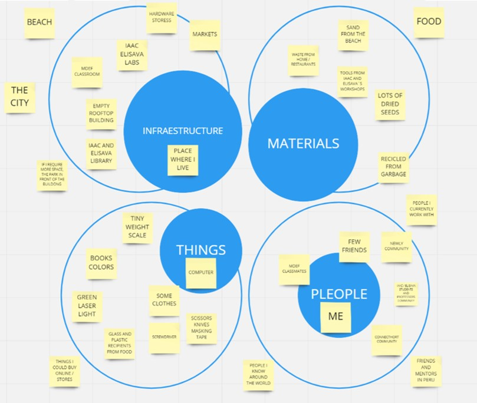
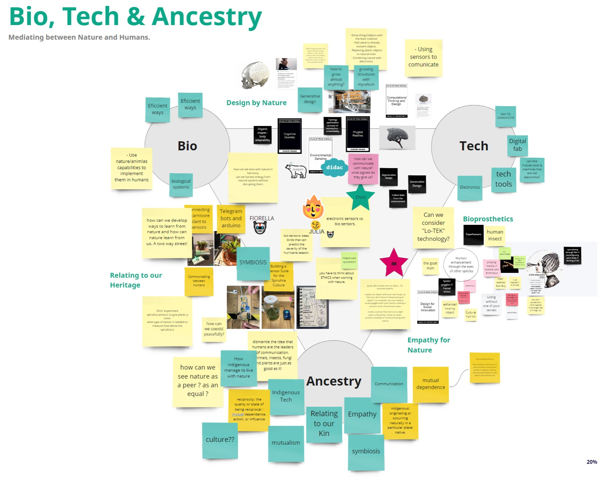
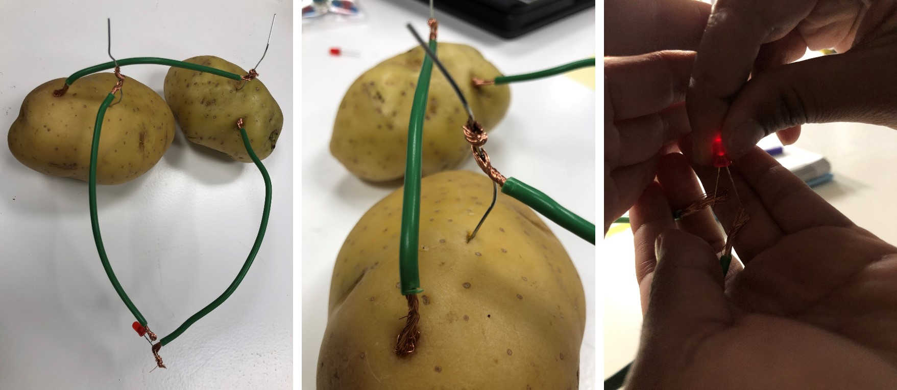

---
hide:
    - toc
---

# Initial ideas

MY WORK SPACE **RtD TOOLBOX**
At the beggining of this excercise, it was very difficult to understand what is my worksapace right now, today, I live in a new city very far away from home, I didn´t bring any tool or equipment, I don´t know where find stuff I could need, new poeple around, and many others facts that question my stability.  However, I have realize that I have very cool workshops, new mentors and people, literally, from around the world with similars interests than me. And, of course, I have me. :)

So, the perspective changed and now the question transmuted in: 
>
    What are my boundaries?
>

GROUP DESGIN ESPACE: **BIO, TECH, ANCESTRY**
Now, that we are separated by interestes, we generate a Collective Design Space based on AoWS.
According what we tought we were very interested in technology based on nature, on our ancestral tecniques; in order to not forget where we came from, but also, revalue.

Principal topics were *empathy for nature, relating to our heritage, design by nature, bioprosthetics.*

LIST OF POSSIBLE EXPERIMENTS TO TRY

REFERENCES I FOLLOW

Experimentation of algae and design.
[Ecologicstudio](https://www.ecologicstudio.com/)

Experimentation through simbiosis.
[Neri Oxman](https://oxman.com/)

Experimentation of art, tech and biology.
[Gilberto Esparza](https://gilbertoesparza.net/)

**EXPERIMENTS ON PROGRESS**

EXPERIMENT1: TURN ON A LED WITH A POTATOE BATTERY
The experiment works, but the Amperage wasn´t enough with the selected potatoes, next task is try with more potatoes, and with more area of metals, and compare the result.

