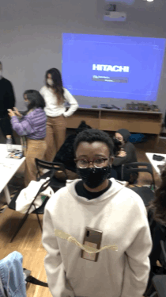
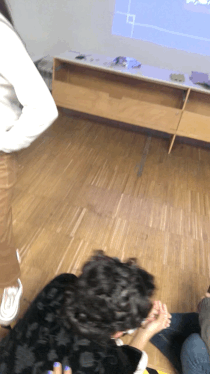
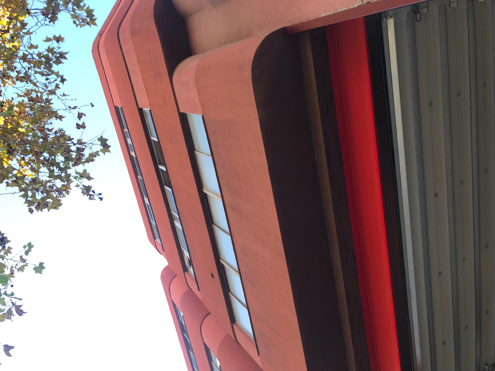
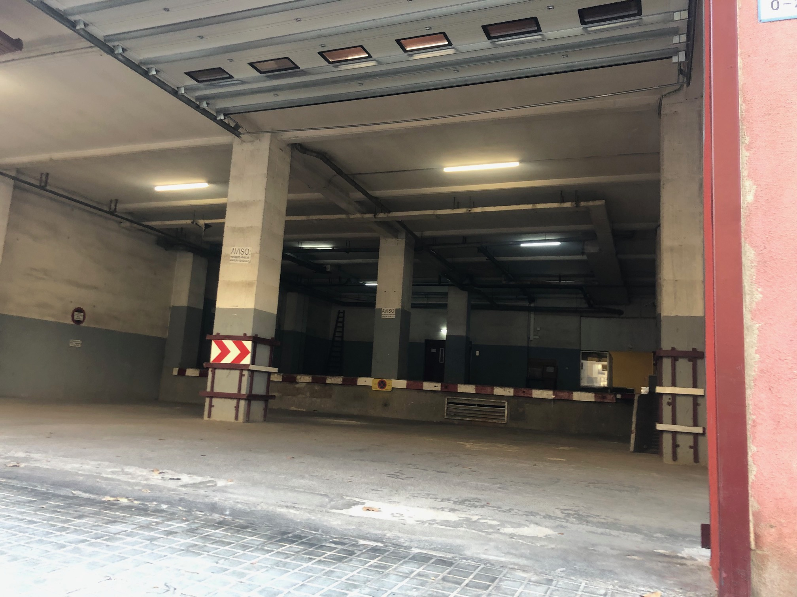
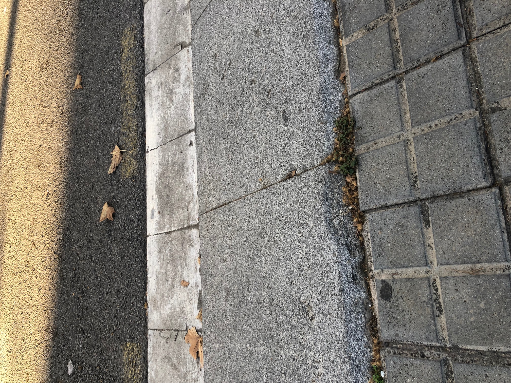

---
hide:
    - toc
---

# Documentation Beyond Presentation

Learning how to document in **First-Person Perspective**

*********
    EXPERIMENT 1: Document whatever from your first-person perspective, 
    but put your camera somewhere else in your body.
I put my Cellphone on top of a cardboard cylinder of approximately 50cm long and placed it on my back, I began to run the video and greet my colleagues. It was a strange sensation because I didn't see what and how I was filming it and people weren't looking at me either. So I relaxed and started playing.
I hope someone has documented me, it was that fun that I forgot to ask for it.

  
  

*********
    EXPERIMENT 2:: Choose a nearly random place to explore. Once you are
    in the place, listen to the audio.
First of all, I felt very safe to do the experimentation, because the audio asks you to close your eyes in the place where you are, and I was in the corner of a street. And where I came from, it is probably that someone else takes your phone.

I was attracted by a red building, it reminds me of a firefighter station, but it wasn't. I thought that if it was the station I could enter, but since it was not I stayed at the door, so I was on the threshold of the building. More outside than inside. We had to choose an audio, but since there were no pauses, I listened to all of them. Anyway, I picked up one: *USE*

The space is use as a parking lot, where merchandise enters and leaves. The big doors opened from the top, so the no-door feel gave it the quality of an open space. When I arrive there was a car with some people around putting things inside it. The place was old, dirty, dusty, inside was painted in gray, it has a double height, few colums,

I found a cockroach.

In some point, it was totally empty; an abandoned place with open doors.

***HOW AM I DOCUMENTING AND COMMUNICATING MY CURRENTLY WOROK?***
It seems to me that my documentation is very focused on mini videos, photos, gifs, and now I am trying to put emoticons but I don´t crack it yet. And, I consider that I have to improve my ways of communication to be understood. Furthermore, to get deep into the communication of the processes and results, involving me on it, and not just as an outsider. 

***EXTRA TOPICS***
>
***leviathan (2012)***
>

