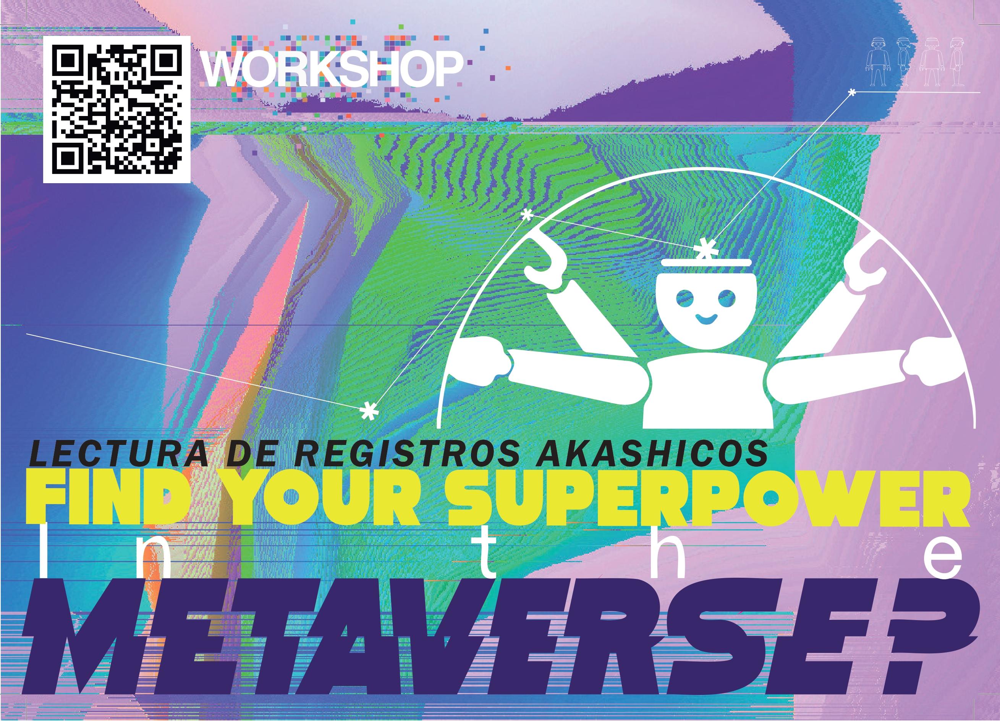
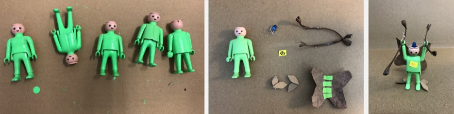
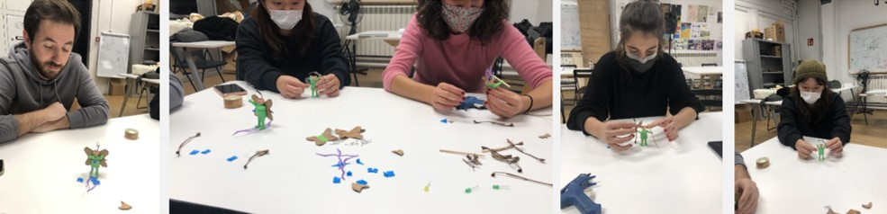
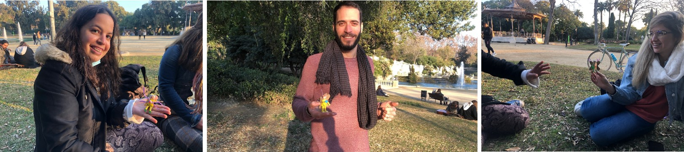
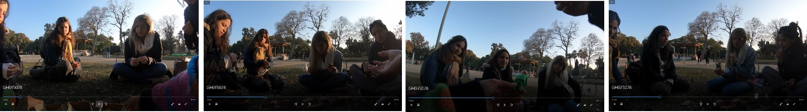
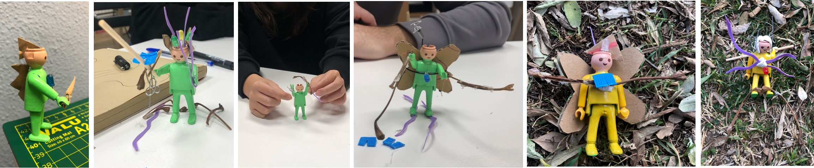
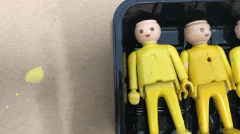
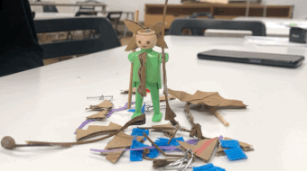
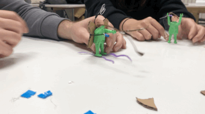

---
hide:
    - toc
---

# DESIGN DIALOGUE TERM 1: 

[EXPERIMENTAL LAB-GAME OF E X T R A SENSORY EXPERIENCES](https://www.instagram.com/6066lab/)

re connect dis connect re connect re connect dis connect re connect dis connect

**° Change Perceptions °**
**° Hack Routine Dynamics °**
**° Show what is not shown °**

**FIRST PERSONAL INTERVENTION**

As a result of be part of the groups and especially the Community Engagement Seminar. It seems to me that I am finally getting close to my desgin path.  In this situation what I want to generate is an:::::::::::::::::::::::::::::::::::::
**EXPERIMENTAL LAB-GAME OF  E X T R A SENSORY EXPERIENCES**::::::::::::::::, which is based on changing the perception of regular or standard situations, starting to questions; hacking routine dynamics which are referenced in slow movement projects; and, show what is not shown, and saying what people don´t usually say, to play with the magic of the universe and quantum physics.

These experiments might present ourselves as a game to disconnect to reconnect once and again. To play the *stop-play-pause* in life. And, in order to catch our attention in very direct perception, this lab must activate your senses. 

These features respond to what my fight is understanding that if we want to coexist peacefully with nature or another environment, we must connect with ourselves first, be in peace with ourselves., know what our power are.

**OUTPUT 0:  WORKSHOP**

The first output of the lab-game is a workshop named: FIND YOUR POWERS IN THE METAVERSE_ Akashic Record Readings.  Understanding the metaverse as “beyond”, using Akashic Records Channeling as a tool, crafting and personal interactions.

**DESCRIPTION**

The Workshop is a game in which every participant selects an avatar and transfers their abilities to it.  It is a projection game.
Once the participants have their avatars, five boxes with gadgets are shown, each box is referred to one element, and each element has a setlist of related words. 
Then, the participants start to join gadgets to their avatars and explain their superpowers.
After that, other participants can describe what they see in their avatar's peer. 
Finally, each participant receives through Akashic Records Readings his/her gits and talent and can remark if they see this new information in his/her avatar, they have the option of adding an extra gadget to materialize it. Or what I call, to bring what already exists in the metaverse.

**OBJETIVES**

Decelerate the routine of the participants to start questioning themselves regarding their abilities and how they use them in their daily life.
Show what Akashic Records is.

**PREPARING THE WORKSHOP ROUND 0**

0. Find the avatars, use second hand toys and visually standardize them.
1. Design the gadgets using recycled materials and leaves from streets.
2. Prepare who to stick the gadgets to the avatars. To the first testing I use silicon bars.
3. Separate the gadgets by elements in boxes made of recycled cardboard.

**TESTING WITH FOUR MDEF CLASSMATES**

I see that they were very hand-crafted people, and they enjoyed playing with the avatars. In the beginning, they were afraid of the Akashic Records Reading; they felt a bit vulnerable, but after the workshop, they were calm; most of the messages resonates with them at the very first word; other messages were processed after, and others probably still in questions.
Time approx. : 80 min. 

**FIRST COMMENTS, FEEDBACKS, REACTIONS**

- This is a projection game.
- This should be with very few people to now loose the warm of the activity.
- A fun game with avatars.
- I don´t think these are my abilities, but I want them to be.
- I don´t undertand well what is this gadget but I felt that I should put them in my head. (referring to the avatar).

**WHAT TO ADJUST TO THE WORKSHOP**

Change the silicon bars to an option without energy.
To open the Akashic Records I have to make a mini-pray for each person, it requires two minutes, but it seems to me that, while people are playing with the avatars I should be doing that, to avoid the waiting.

**WORKSHOP IN THE PARK**

I put a poster in a sculpture: FREE WORKSHOP; in adittion, I put an extra poster: HUG THIS TREE IS FREE to complement the vibe of the workshop.

Some people look at it but were not interested in the workshop it was not clear.  Then, I invited people around, and a group of four people accept the invitation.
One person that hugged the tree join the workshop without actually knowing what it was about.
Time approx. : 40 min. 

**COMMENTS, FEEDBACKS, REACTIONS**

They were sorprice for the kind of wotkshop, and also very grateful for the messages. I gained 3 new followers. They said they were interested in new workshops.

**WHAT´S NEXT**

I think it could be interesting if the workshop generates activities to embodying the superpowers or somehow activate them with exercises.

To join an existed community to generate similar activities with them, not just workshops, and try to absorve the vibe of this movement in BCN.

 
 
 

