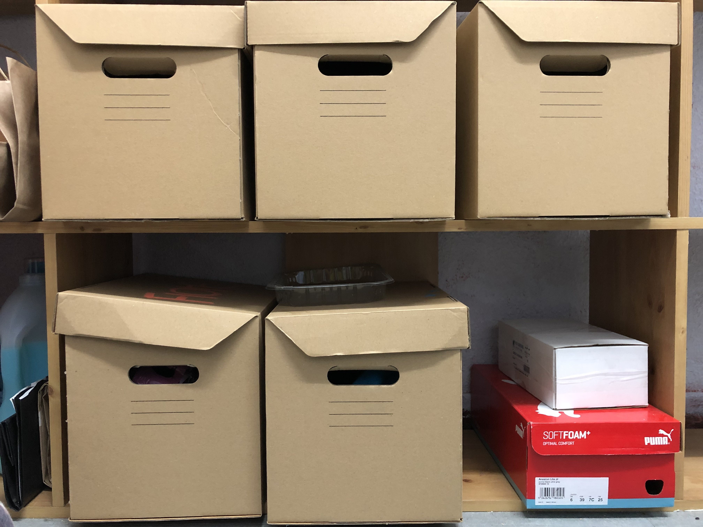
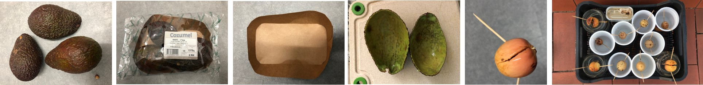
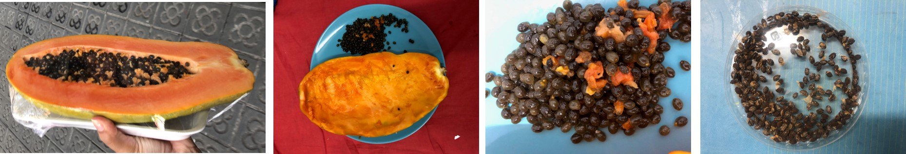
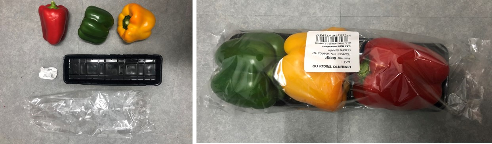

---
hide:
    - toc
---

# 1PP DESIGN INTERVENTION IN CONTEXT: 

1ST INTERVENTION OF TERM 2
A WASTE DOMESTIC-CONTAINER

h2>1ST INTERVENTION OF TERM 2</h2>
 
<B>A WASTE DOMESTIC-CONTAINER</B></pstyle>
 
 <b>ME AS A DESIGN TOOL IN CONTEXT</b></pstyle>
  

  

      °°°°°°°°°°°°°°°°°°°°°°Recycling Lifestyle°°°°°°°°°°°°°°°°°°°°°°°°°°°°°°°°°°°°°°°° 
      °°°°°°°°°°°°°°°°°°°°°°As a designer, I could see the potential of new materials°°°°°°°°°°°°°°°°°°°° 
      °°°°°°°°°°°°°°°°°°°°°°Document everything with the methods learned and practiced°°°°°°°°°°°°
      

      
      

 
 <b>CONTEXT</b></pstyle> 
    

      I have been segregating some of my food peels, during the last term to see what could I do next, without see it as an opportunity to document it. When we were ask to bring some to one of the seminars they worked perfectly, they were a lot, they were desidratated and free of bacterias.  
      So I restarted again, and, in some point of the last weeks I saw a bunch of <b> carboard boxes</b> with segregated materials in my bedroom, then I thought that maybe, all of them might need their own organized space in the flat. 
    
 

    The question was <i>what can I do with them?; how much can I still contain in my room?; what if my roommates join?; what if my building join?. what if my block join?</i>
    

    
In addition, the biomaterials seminars was running and many cool option appeared, and also, projects like "Remix El Barrio" that can offer many options and opportunities in this topic still having problems of how to sustaine theirself economicaly, as they said.

   

  In that case, how can I join somehow to that community?, what If I offer the waste I collect?, how many of the collected is required to  have options of develop "something"?. Because, what I have realized is that what "we" are looking for comercial stores because they already have the same of one product-waste in the same container or bag. Few of them segregate, and also, it is kind of hard because it require time and some requirements. Not to mencionate that it has to be daily, because they occupy space, and probably they smell weird if it is not; unless we find a solution that suits them.
  

 
 
  

  
 <b>WHAT DO I WASTE (MORE)?</b></pstyle> 

    

      This photos are from food waste. I don´t usually recycle non-biomaterials waste because they require more space. In addition, I collect the seeds of the food to reproduced them in the next season.
      

      
As a part of the last term experimentation, I tried worms compost to improve my abilities of recirculation processes; and also, because I wanted to generate electricity with them, but they died. Apparently, they were changed in their environment many times that they freeze, also, I bought them too soon. One of the reasons to not survive is the food I gave them, they weren't enough decompose. 

 
  
   

    
    
    

    
 <b>WHERE TO JOIN?</b></pstyle>
      
 Working progress mapping

  
 <b>SO, WHAT IS THE PLAN?</b></pstyle>
    
The plan is to develop a <b>WASTE CONTAINTER</b> in my flat which it is going to be separated by types in the way I was doing it, with the option of mutate
    acording it is been used.

    
Made in cardboard in the begining to test it, then I think it could be interesting to develop it with the materials I collect.

    
Requirements depends on the type of collected material. 
      They will appear according the use, but the things I have already detected are: 
    

    
Some ideas......
              1.Porous material, like cardboar or clay. Or, with holes. 
             2.Ventilation, the air has to get IN and OUT of the container. 
             3.Protection, some of them because of the bacterias. 
             4.Divided by size of the waste. 
             5.Be aware that some of the materials dripping liquids. 
             6.Most of them has to be clean. 
             7.The smallest possible to be accepted in the flat. 
             8.Some of the peels like oranges smell good, try to put in a specific spot. 
             9.Have in mind the continuity of use of each material waste.
            

     
Test it.

 
 <b>THE INTERVENTION</b></pstyle>
  
WHERE: In the flat.

  

    Once the container is installed; as a daily routine: the <b>WASTE CONTAINTER</b> must to be checked and fill the documentation paper check. 
    The idea of the intervention is to visualize the opportunity of the material to reincarnated in objects for design or art. And generate and engagement with the 
    people that contribute to collect.
      

  
As a part of the intervention, I propose to design and object to each of the collectors.

  

  
 <b>PLUG-IN::::::::::::::::: T H E  P L A S T I C::::::::::::::::::::::::</b></pstyle>

 
 <b>DOCUMENTATION</b></pstyle> 
  

 <b>SHOWING POSSIBILITIES OF YOUR WASTE</b></pstyle> 
  

  
<B>WHERE IS THE METAVERSE NOW</B></pstyle>
  
 <b>ME AS A DESIGN TOOL IN CONTEXT</b></pstyle>
     
   
     

         °°°°°°°°°°°°°°°°°°°°°°Love to play°°°°°°°°°°°°°°°°°°°°°°°°°°°°°°°°°°°°°°°°°°°°°°°°°°°°°°°° 
         °°°°°°°°°°°°°°°°°°°°°°Channeling of Akashic Records°°°°°°°°°°°°°°°°°°°°°°° 
         °°°°°°°°°°°°°°°°°°°°°°Document everything with the methods learned and practiced°°°°°°°°°°°°°°°°°
         

         
      
   
    
 <b>CONTEXT</b></pstyle>     
   
    
 <b>WHAT IS THE PLAN?</b></pstyle>

      
 <b>THE INTERVENTION</b></pstyle>
   
    
 <b>DOCUMENTATION</b></pstyle> 