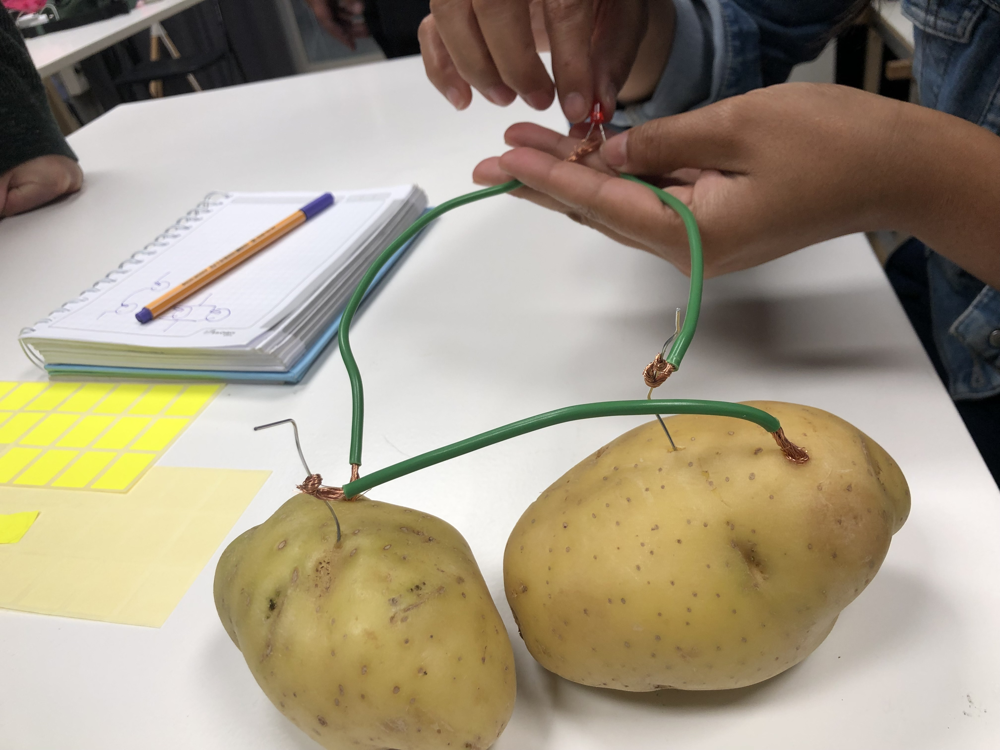
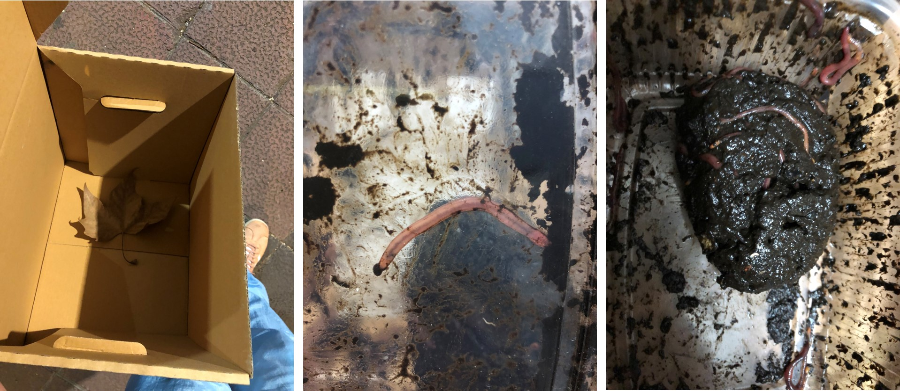
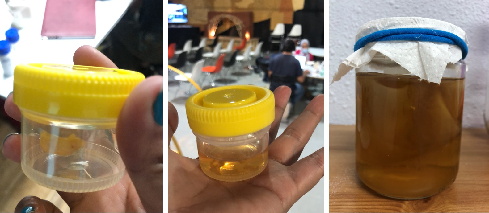

---
hide:
    - toc
---

# Initial ideas

MY WORK SPACE **RtD TOOLBOX**

GROUP DESGIN ESPACE: **BIO, TECH, ANCESTRY**

LIST OF POSSIBLE EXPERIMENTS TO TRY

PAST EXPERIMENTS THAT I WOULD LIKE TO GET DEPPEN

REFERENCES I FOLLOW

Experimentation of algae and design.
[Ecologicstudio](https://www.ecologicstudio.com/)

Experimentation through simbiosis.
[Neri Oxman](https://oxman.com/)

Experimentation of art, tech and biology.
[Gilberto Esparza](https://gilbertoesparza.net/)

**EXPERIMENTS ON PROGRESS**

EXPERIMENT1: TURN ON A LED WITH A POTATOE BATTERY
The experiment works, but the Amperage wasn´t enough with the selected potatoes, next task is try with more potatoes, and with more area of metals, and compare the result.

EXPERIMENT2: COMPARE TYPES OF COMPOST AN TRY TO GENERATE ENERGY FROM THEM
I am sharing this experiment with Rei, a friend and Mdef classmate, We have the boxes to compost, we are collecting the leaves for the first layer. And the Californian worms just arrive!.

EXPERIMENT3: KOMBUCHA
In the week 03 - Agri & Bio Zero, we start a baby kombucha, but it didn´t work, so, I ask for a new scooby in the Kombucha community, and it just arrive yesterday as well.

