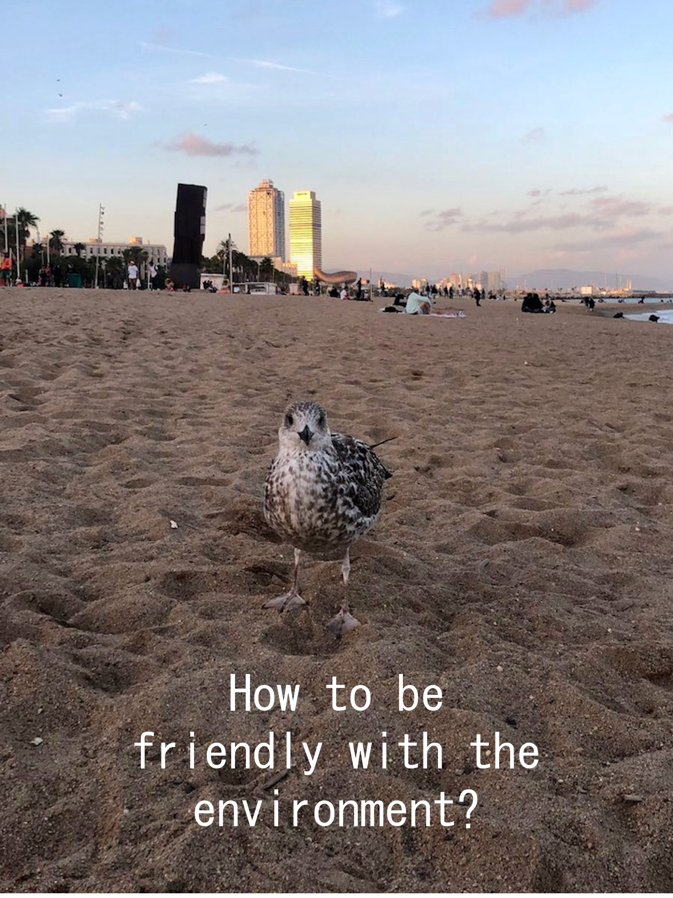
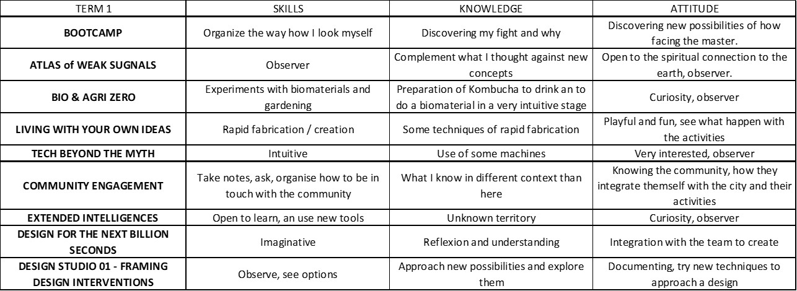

---
hide:
    - toc
---

# Bootcamp

WHAT IS MY FIGHT?

My fight is to question how can we coexist with the nature without disturb or damage the environment of the animals, plants, fungi; or ourselves, as well.
>
 ***Can we coexist peacefully?***
>
I mean, now, we know that we haven´t been doing it right. Apparently,  systems, mechanism, economies, that we have been use for very long time are out of control and are damaging our planet. Furthermore, it is part of several cultures around the world right know. So, *how much does nature can resist us?*, *can we change the vibrations, fecruencies and behaviors, henceforth?*
>
Some how, It seems to me, that part of ***our fight*** is to imagine what kind of solutions we can offer to redesign manners to do it propertly, lovely, respectfully. And start them now. 

In the poster, there is an image that I took two days ago when I went to the beach; a pigeon came to me and walk around very close and confortable. Surprisingly to me, because I was kind of disturbed with too many people around there. Anyway, it was its beach, and I was the foreigner.  I took that as a welcome.
>
As a designer, I have learned, as a priority, to understand how to address a design to optimize the experience of users in the plan of any project. However, recently, appeared in my mind, actions and factors that we have to look for and fight for. 

HYBRID PROFILES

How do I recognize myself as a designer?
Am I conscious of all the potentials and weaknesses that I have?

After elaborate the profile, I have realized skills, knowledge and attitudes that I wasn´t aware of. It was an exercise to recognize.

ADDRESSING THE NEW KNOWLEDGE 

It is going to be very interesting comparing this picture with the after-course picture one. 