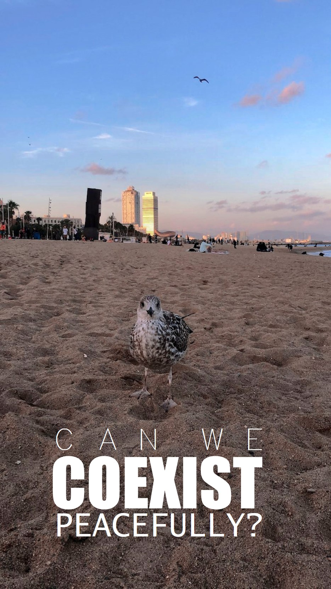
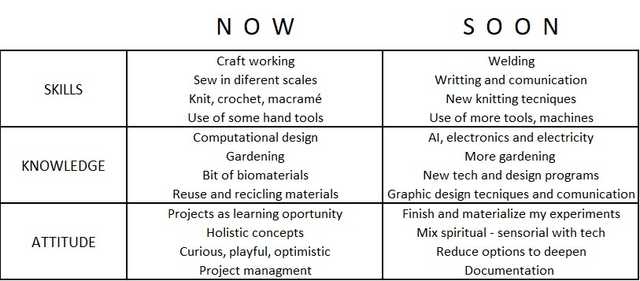

---
hide:
    - toc
---

# Bootcamp

**WHAT IS MY FIGHT?**

***My fight is to question everything that catches my attention*** and try to generate something that hack it, with the tools, budget and time I have. As long as it is fun for me.

I recently started to question *how can we coexist with the nature without disturb or damage the environment of the animals, plants, fungi, all the ecosystems that we know and don´t know*. *How can we coexist with ourselves?*, if we all live together and think different,  if everything they have taught us so far no longer works.

how can we do it right knowing that every action generates a consequence, that every design triggers situations that probably we won´t be aware of how to deal with in a global space. 

>
 ***Can we coexist peacefully?***
>
As we no know so far,  systems, mechanism, economies, that we have been use for very long time are now a days out of control and are constantly damaging our planet. Furthermore, 
these behaviors have become part of several cultures around the world right know. Such as plastic everywhere, more garbage without any circular process on head, more and more waste of energies, extracting minerals *just by playing Monopoly*.

 So, *how much does nature can resist us?*, *can we change the vibrations, fecruencies and behaviors, henceforth?*

 ***Where do we start?***

>
Some how, It seems to me, that part of ***our fight*** is to imagine what kind of solutions we can offer to redesign manners to do it propertly, lovely, respectfully. And start them now. 

In the poster, there is an image that I took two days ago when I went to the beach; a pigeon came to me and walk around very close and confortable. Surprisingly to me, because I was kind of disturbed with too many people around there. Anyway, it was its beach, and I was the foreigner.  I took that as a welcome.
>
As a designer, I have learned (as a priority) to understand how to address a design to optimize the experience of users in the plan of any project. However, recently, appeared in my mind, actions and factors that are related to what I explaned lines before that we have to look for and fight for. 

**UP-TO-DATED-FIGHT-POSTER**

What I want to represent in this poster is the actual intervention of my activities relate to my fights and as a waves that come and goes what I expect is to find my truly path.

**EXPECTATIONS**

I feel very curious about being in BCN, I perceive it as a small, contemporary, and multicultural city near to the beach and a Region Natural Park. I have the feeling that various activities can be generated in the city and the people, hopefully it reaches the time.

**HYBRID PROFILES**

How do I recognize myself as a designer?
Am I conscious of all the potentials and weaknesses that I have?

After elaborate the profile, I have realized skills, knowledge and attitudes that I wasn´t aware of. It was an exercise to recognize.

**ADDRESSING THE NEW KNOWLEDGE**

It is going to be very interesting comparing this picture with the after-course picture one. 