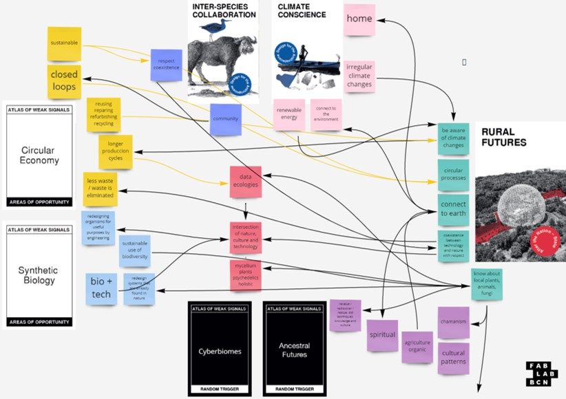
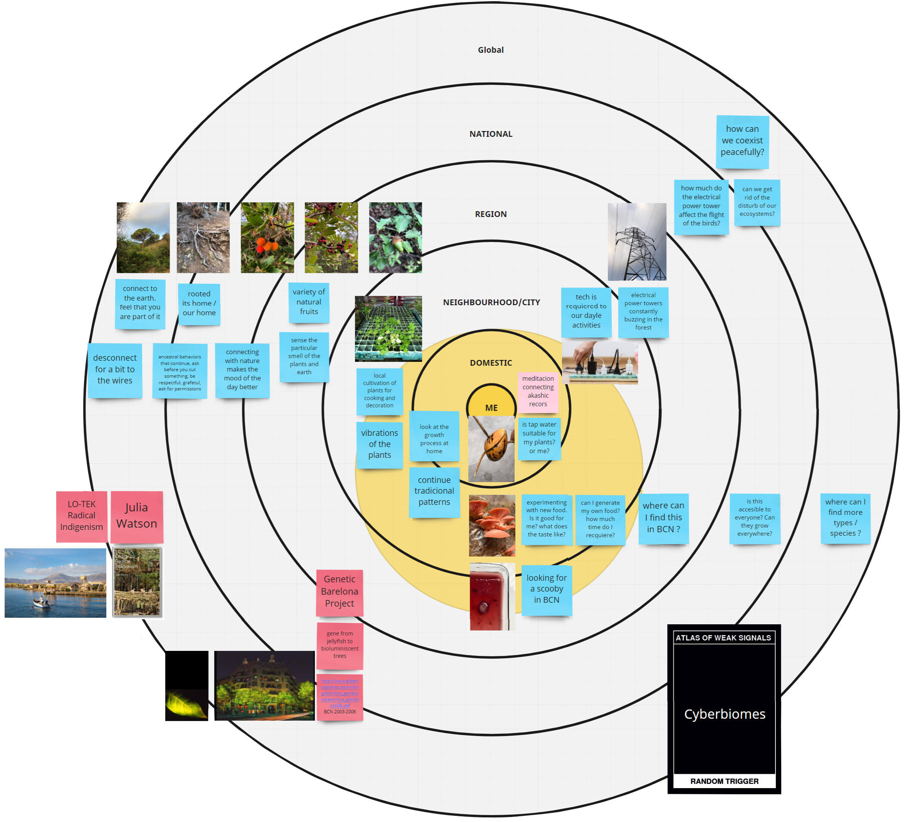
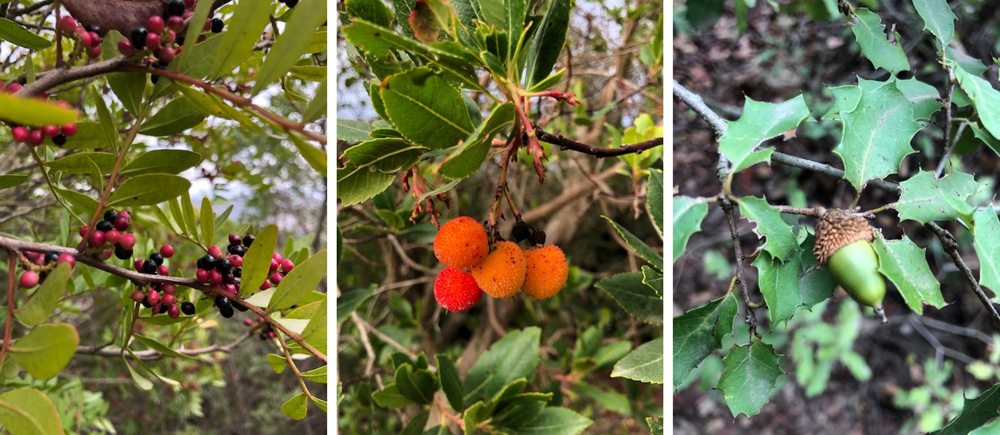
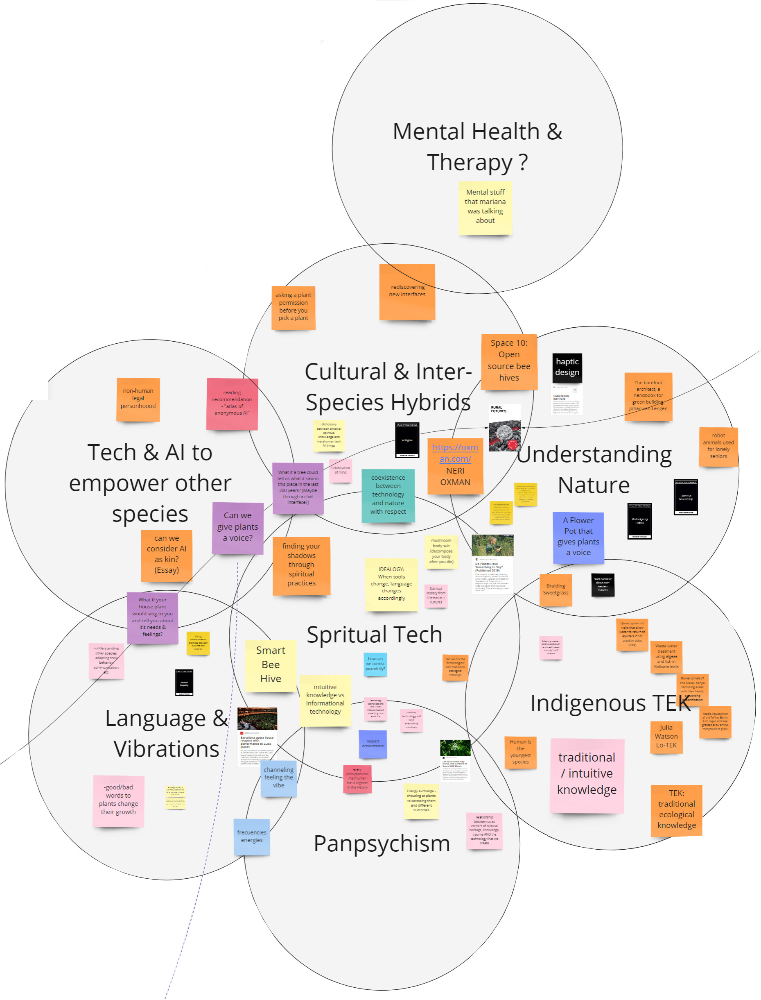

---
hide:
    - toc
---

# Atlas of Weak Signals

DESIGN SPACE

The main weak signal I choose was *Cyberbiomes* because I´m very interested in how technology can be related to nature throw arts and culture; how the simbiosis of these can create and evolve. In addition, there are too many options in which this movement can be related to, such us, *SolarPunks*.
But, while we were developing the exercise, more weak signals appeared in my mind, *Inter-Species Collaboration*, *Ancestral Futures*, *Panpsychism*, concepts that are new for me but at the same time I feel very related and close. 

*Inter-Species Collaboration*, because, I realized that how important is the respect, connection and link we have with our environment, in every field or circumstance, we are all together, here, living in the same planet, an maybe here is the link with *Panpsychism*, I believe that everything has a register in the history. I guess, here is the linked with my fight from last week. 

And that is when the second weak signal showed itself, *Ancestral Futures*, how our culture, and what we have been taught subtly manifests itself when we face, look, and interact with other cultures.
Is it that important as I feel? Or it is just chamanism. Is it ok to be a chaman and use technology?
What are the limits, and, where are the boundaries?  Can we coexist pacefully, can we work together for the same cause? Anyway, we all are in the same planet.

MULTISCALAR DIAGRAM

We started in the Collserola National Park, a protected park nearby the city of Barcelona. So, it enters the Region / National part in the multiscalar diagram.
Starting from there, it is a privilege to have very close to the city a slight piece of forest to connect with, and at the same time disconnect to wires,  although we always had internet access.

What I found here is a variety of a couple of fruits, plants; lots of roots in surfaces as a reminder of an underground natural connection. We could enjoy the transit of the birds and their sounds.

*Also, an electricity tower system was buzzing.*

Apparently, this was a reminder that we were still close to the city. And of course, to supply our demands. The question could be, Is there another way? Are these vibrations and buzzing affect the animals and plants? Or us ?.
Going home, plants still going around, and the buzzing started to disappear, but, was it disappear or just we get used to the sound? or maybe other kinds of buzzing or vibrations appeared, to normalize it?

COLLSEROLA TRIP

This photos were taken from the trip with the Mdef group.

COLLABORATIVE DESIGN SPACE

It was very interesting and exciting to find similar interests in the group, linked to the spiritual, holistic, ancestral, and technology.

WOULD LIKE TO CONTACT

Julia Wats.
*Lo-TEK Radical Indigenism.*

Claudia Pasquero.
*EcoLogicStudio.*

EXPERIMENT TO MAKE

-Music with plants.
-Decoding Vibrations / Frecuencies.
-Bioluminiscence.
-Try to generate energy.
-Reproduce fungi.
-Reproduce kombucha.

NEW SKILL TO ADD

-Biology .
-Mushrooms.
-Algae.
-Chamanism.
-Composting.
