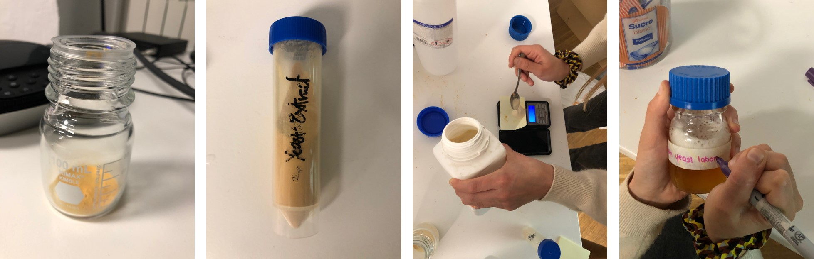
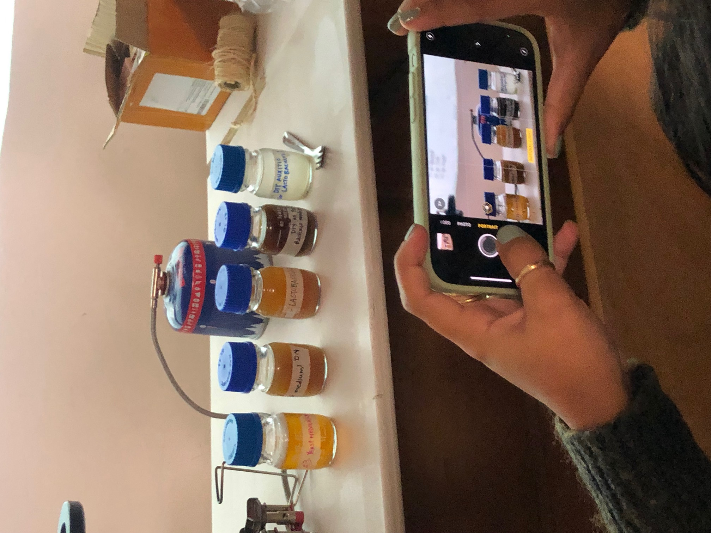
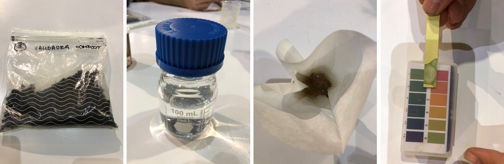

---
hide:
    - toc
---

# Agri & Bio Zero

**EXPERIMENTATION IN CLASS**

EXPERIMENTING WITH BACTERIAS

First, we prepare the environment before to pick the samples

We were separete in groups, and each group prepare different environments.

We put the prepared bacteria environment in Petri dishes near a hot temperature to avoid contamination.

I picked two samples of bacteria, one from my shoes, the other one from my cellphone. And, they start growing through the days.s

ELABORATING LAUREL ESCENTIAL OIL 
Great and very laborious job.

TESTING SOIL, PH MEASUREMENT

**HYPOTHETICAL DESIGN ORGANISM DESCRIPTION**

[Silk Protein (spidroin)](http://parts.igem.org/wiki/index.php/Part:BBa_K3264000)

References:
[SPIDroin EngineeRing with chroMoprotein And Natural dye](https://2019.igem.org/Team:GreatBay_SZ)

WORKING PROGRESS . . . .. 

**RESEARCH PAPER SYNOPSI**
*********
>
[Electrochemical Characterisation of bio bottle voltaic BBV Systems Operated with Algae and Built with Recycled Materials](https://www.researchgate.net/publication/324589610_Electrochemical_Characterisation_of_Bio-Bottle-Voltaic_BBV_Systems_Operated_with_Algae_and_Built_with_Recycled_Materials)
>

The paper explains why and how we can generate renewable energy with algae through photosynthesis using recycling materials.

The paper explains that photoelectrochemical systems are an emerging possibility for renewable energy, exploiting photosynthesis algae to transform the energy of the sun light into electricity. The used algae are *Chlorella sorokiniana*. 

It uses Biophotovoltaic systems to provide a natural resource, solar cells use the photosynthesis activity of microalgae to harvest solar energy; during the photosynthesis, water photolysis results as the splitting of water into protons, oxygen, and electrons which are kept in the surface of the water to being used as an anode and cathode later in the experiment.

Materials they used to do the experiment are recycled PET plastic bottles to contain the algae, the algae, three aluminum recycled can which works as an anode inside the plastic bottle. The algae *Chlorella sorokiniana*, a plastic lid that hosts the cathode and copper connectors. All of these, to create the **Bio Bottle Voltaic BBV System**.

As a result shown in the paper, algae culture and the biofilm it generates weren´t affected by the aluminum in it; algae can generate electricity using recycled materials. However, the energy output is very low to turn up equipment that we usually use, but it was used in art events and might be shown as a toolkit in schools, as the paper suggests. Apparently, in order to obtain results to be used in daily life, it is required to have *low-energy* devices off-grid.

