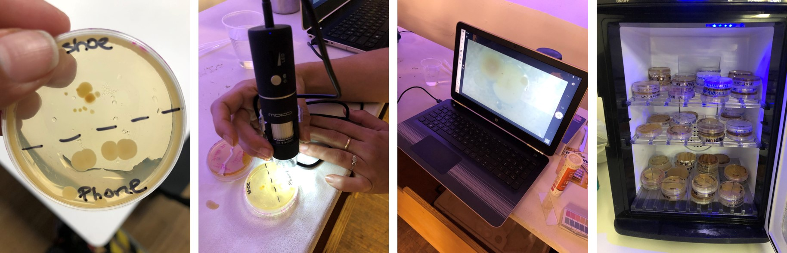

---
hide:
    - toc
---

# Agri & Bio Zero

EXPERIMENTING WITH BACTERIAS

First, we prepare the environment before to pick the samples

We were separete in groups, and each group prepare different environments.

I picked two samples of bacteria, one from my shoes, the other one from my cellphone. And, they start growing through the days.s

ELABORATING LAUREL ESCENTIAL OIL 
Great and very laborious job.

TESTING SOIL, PH MEASUREMENT

