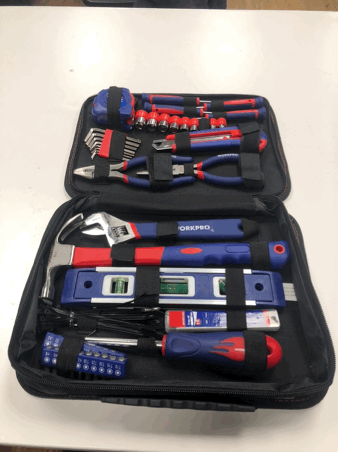

---
hide:
    - toc
---

# Tech Beyond the Myth

Lets play!

Forensic Report: Apple Laptop 
===============

| Identity of the reporting agency       | MDEF                           |
|----------------------------------------|--------------------------------|
| Case identifier                        | Forensics of the Obsolescence  |
| Identity of the submitter              | Someone at the Fab Lab         |
| Date of receipt                        | 09/11/2021                     |
| Date of report                         | 09/11/2021                     |
| Identity and signature of the examiner | Fiorella, Rei, Emilio, Andrea                     |

## Examination 

:::warning

serial number: CK6s0083WH4
Brand: Apple (in California)
Model: A1195
Color: White
Assemblied in: China
Specifications: Canadian ICES-003 Class B

:::

## Forensic Questions
:::warning
**What does it do?** 

It is a personal computer , used for personal work like word processors, it has a camera and microphone built in, for video calls for example, and also has a pair of speakers for sound reproducing.
This model has an optical unit or CD/DVD ROM that can reproduce and burn cd/dvd. This could be used for playing videos or movies.
This computer has a WIFI modem, so it can be connected to the internet.
I have an Intel processor and 8 GB of RAM. It have a monitor and  3 USB ports, 2 input/output for audio and video, and Ethernet port
This device could be used for personal use or work.
This computer in particular still works fine but the capacity of the new equipment makes it obsolete and slow, not adequate to work with the requirements of the equipment, which is  the case of some of the electronic devices. It is not used because it is cheaper and accessible  to buy new equipment at a lower cost. Also hardware like the main processor is expensive and difficult to replace for a new one in order to maintain the device in optimal operation.The RAM memory could be replaced but it is difficult for anyone.
Also Apple stops at certain points to release actualizations to the IOS so that lead to small failures and errors in everyday use.

**How does it work?** 
* the chargeable battery provides power.

---

**How it's built?** 
* body (aluminium)
* inner part (magnesium)
* screws
* cables

---

**Why it failed, or it wasn't used anymore?**

:::

## Steps taken
:::warning

**Opening the laptop**
First of all we checked if the computer worked. It can be switched on and on the screen appears the log in accounts. 
We could check that the iMac worked but we couldn’t check if any program could be run. So, we cannot affirm if the iMac was discarded because of the requirements or utility. 

We had to check a video to know how to start the disassembly of the computer. We started removing the front part of the case. In order to unscrew we had to find a specific screwdriver because of the special screws. 

## Opinions
:::warning
