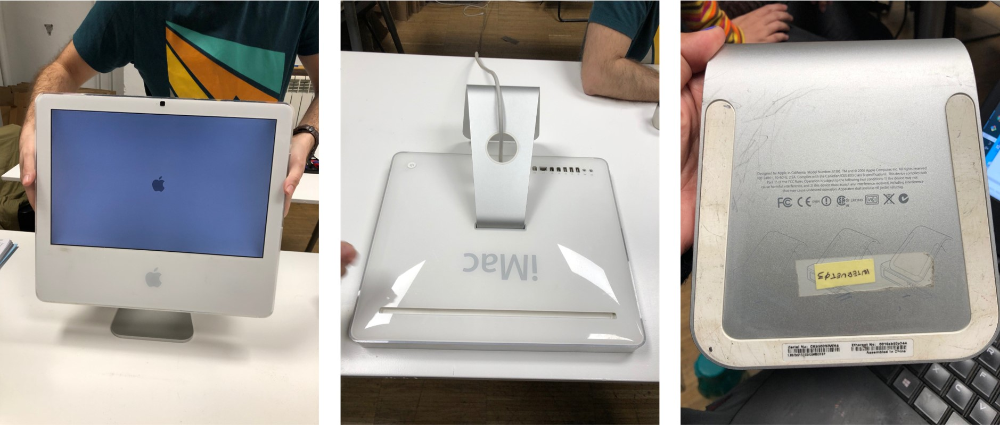
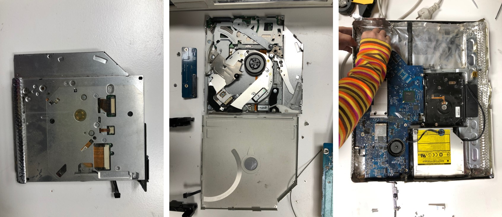

---
hide:
    - toc
---

# Tech Beyond the Myth

Forensic Report: Apple Computer 2006
===============

| Identity of the reporting agency       | MDEF                           |
|----------------------------------------|--------------------------------|
| Case identifier                        | Forensics of the Obsolescence  |
| Identity of the submitter              | Someone at the Fab Lab         |
| Date of receipt                        | 09/11/2021                     |
| Date of report                         | 09/11/2021                     |
| Identity and signature of the examiner | Fiorella, Rei, Emilio, Andrea                     |

## Examination 

serial number: CK6s0083WH4
Brand: Apple (in California)
Model: A1195
Color: White
Assemblied in: China
Specifications: Canadian ICES-003 Class B

## Forensic Questions

It is a personal computer , used for personal work like word processors, it has a camera and microphone built in, for video calls for example, and also has a pair of speakers for sound reproducing.
This model has an optical unit or CD/DVD ROM that can reproduce and burn cd/dvd. This could be used for playing videos or movies.
This computer has a WIFI modem, so it can be connected to the internet.
I have an Intel processor and 8 GB of RAM. It have a monitor and  3 USB ports, 2 input/output for audio and video, and Ethernet port
This device could be used for personal use or work.
This computer in particular still works fine but the capacity of the new equipment makes it obsolete and slow, not adequate to work with the requirements of the equipment, which is  the case of some of the electronic devices. It is not used because it is cheaper and accessible  to buy new equipment at a lower cost. Also hardware like the main processor is expensive and difficult to replace for a new one in order to maintain the device in optimal operation. The RAM memory could be replaced but it is difficult for anyone.
Also Apple stops at certain points to release actualizations to the IOS so that lead to small failures and errors in everyday use.

---

## Steps taken

**Opening the laptop**
First of all we checked if the computer worked. It can be switched on and on the screen appears the log in accounts. 
We could check that the iMac worked but we couldn’t check if any program could be run. So, we cannot affirm if the iMac was discarded because of the requirements or utility. 

We had to check a video to know how to start the disassembly of the computer. We started removing the front part of the case. In order to unscrew we had to find a specific screwdriver because of the special screws. 

After that, we had to disassemble the camera and other devices such as the microphone that was attached to the case. Then we could separate the screen and some parts of the aluminium that covered the electronic system. 

Datasheet for the logicboard (motherboard)
[Apple iMac A1195 Logic board](http://www.barebonekit.net/apple-imac-a1195-820-1960-a-logic-board_i_mballpe8201960a.aspx)

## Results

Q.How many motors we find inside, does it contain a computer or microcontroller?
3 motors.  It contains a microcontroller.

Q.Did the appliance fail, why?
It was properly working when we turned it on.

Q.Did the appliance failed?Why?
This computer in particular still works fine but the capacity of the new equipment makes it obsolete and slow, not adequate to work with the requirements of the equipment, which is  the case of some of the electronic devices. It is not used because it is cheaper and accessible  to buy new equipment at a lower cost. Also hardware like the main processor is expensive and difficult to replace for a new one in order to maintain the device in optimal operation.The RAM memory could be replaced but it is difficult for anyone.
Also Apple stops at certain points to release actualizations to the IOS so that lead to small failures and errors in everyday use.

## Conclusions

It was all different kinds of functions and its parts combined in one box. Each functional part was connected to the motherboard with plugs in.

Most of the parts are made by different suppliers. 

Camera, speakers, disc utility, microphone, and hard drive are easy to recognize. 

When we accidentally dropped the CPU to the floor, it bent and was unable to be used again. Some parts are really fragile when it's open.

There are more than 100 screws used inside.

Most of the metal parts are aluminum. Metals are both manufactured by stamping, the stand might be molded. 

Plastic parts(box) are coated polycarbonate.

Everything except the screen is covered with an aluminium sheet in order to avoid heat and radiation.

Some screws are hidden and some parts are glued so that Apple technical support will be able to know if a user opens the computer by themself so that Apple will not support it anymore.

## Opinion

At opening from the bottom there are two kind of screws, the normal one Phillips screwdriver, but they use a special type of head that is not available to general in public, so that doesn not allow anyone to open the device, you have to take it to Tech support in order to have it open and the computer

The camera card is no attached to the led that show when it is turned on, they are two separates circuits,  so that opens a discussion about how that hardware is used, if it is fully controlled by the user with a physical switch or controlled by a backend command by the builder
The body  it Is combined with the PC plastic and steel as a structure, aluminum is used as an isolation back and forward.

There are a lot of boards with different materials, connectors , circuits and capacitors and disipators and most of them are fixed by special screws, almost 85% of them, the rest are regular screws.

We can also find a few metals for heat displacement like aluminum and copper.

There are also tiny plastic parts that make the connection to the back part of the computer and the boards or the optical unit to the lateral of the computer.

***********
***********
***********
***********

Sense-Making Journal - Urban Gardeners
====================

:::info
A report by the Urban Gardeners team 🌱 : Gerda, Fiorella, Paula, Emilio, Audrey and Busisiwe
:::

**Journal Index**

[TOC]

## From objectives to the hypothesis

### Brainstorming

### Project Goals
objective:
**I WANT TO PRODUCE MY FOOD.**

*Can I produce the ingredients of my meals at home or my neighborhood?*

hypothesis:
**I CAN PRODUCE THE INGREDIENTS OF MY MEALS AT HOME OR MY NEIGHBORHOOD.**

### Tips
We recommend that, in order to realize the experiment properly, we require to collect data during the year, because of the time of growth of the plants.

Nutritional data is required to estimate possible species to grow, and therefore the space demanded for a person to grow his food.

In addition, being aware that particles in the air and other gases might affect the correct development of plants.

And, try to not be around the sensor while it is doing the measurement because it affect the results.

## From hypothesis to data

### Tools selection

We chose the **CITIZEN SENSING TOOLKIT**
http://making-sense.eu/wp-content/uploads/2018/01/Citizen-Sensing-A-Toolkit.pdf

We selected it because we wanted to figure out how is the weather (temperature, humidity, light, eCO2, eVO2) in the possible free spots to grow food in the neighborhood and compare it to what the plants require to grow there.

### Tool usage documentation
The process can be replicated using the same **Citizen Sensing Toolkit**, what we recommend is to do it at different times a day and in all the seasons if it is referred to growing plants.

Check the *outliers* when you download the information.

#### Data capturing strategy
First, we choose the places that are already working as urban gardens, then we start thinking of possible places that might be used to check if they can be used to growing the food, and what types of food might be there.

The data was taken from  14:30pm to 16:30pm in 7 places that we checked before start.

Then we download the data in the laptop to start the cleaning of the information.

#### Materials needed

- Smart citizen kit sensor
- USB cable
- Computer to configure the SCK
- Cell phone to connect the SCK using WiFi connection, and take pictures and videos to documentation.

#### Detail setup instructions
- The first step is to connect the battery. The kit will light in red (configuration mode)
- Sign up to the Smart Citizen Platfom
- When the light is red, the CSK is ready to set up, either by WiFi or SD Card connection
- When the light is blue, the SCK is on  Wi-Fi connection. In this way, the device will publish the data every minute on the smartcitizen.me platform
- When the SCK is pink, it is on offline mode and is saving the information on the SD Card
- When we measured, we pressed the button once until the light turnd pink, we measured for 10 minutes then switched it to standy turning the light red 
Find a good and clear location to place the *Citizen Sensing Toolkit*. If you need to measure light, make sure it is "face up".

#### Data collected

Using the Smart citizen kit, we planned to visit 6 different locations to gather data on light quality, humidity, Temperature and particle matter.

MAP OF LOCATIONS WHERE DATA WAS RETRIEVED

IAAC-ROOFTOP

JARDINS DE MERCÉ

CONNECTHORT

AV. D'ICARIA
 

CEMETERY

PARC MARIPOSA

CARRER DE PUJADES

The raw data is provided in spreadsheets:

#### Tips

*We would have to measure with multiple devices in order to have the conditions in different places at the same time of the day and for a longer time*

## Data capture

### Data summary

| Data Summary             |                    |
|--------------------------|--------------------|
| Project Title            | Urban Gardeners    |
| Capture Start            | 11-11-2021         |
| Capture End              | 12-11-2021         |
| Original Data Format     | CSV file    |
| Submitted format         | CSV file           |
| Total Data Points        | 359                |
| Number of datasets       | 2                  |
| Data Repository          | https://github.com/fablabbcn/mdef-a-world-in-data/tree/main/urban-gardeners  |

##    Optimal Conditions

## Data insights

- We compared the data captured in the 7 spots.

To improve the data:
-  We would need to take measurements of all year and at the same time in different places.
- In order to have an efficient use of the space for producing the plants, we would have to measure characteristics of the soil as well (nutrients, chemicals, ph, etc.)
- Other parameters could be taken into account: available time of people to take care of it, space available.

**Raw data**

We used google sheet pivot tables to agregate data into averages by location and also to focus on specific parameters.

**Average of data by location**

**Focus of each location data to remove potential outliers**

**Comparision bubble chart**

* x = temperature
* y = light
* diameter of the bubbles = CO2 particules

We displayed the ideal location conditions needed for the 4 vegetables we studied above.

Potatoes, carrots : not any location studied respond to the requirement of light needed

Lettuce, tomatoes : only the rooftop of IAAC would allow us to grow these!

We need to continue the research on the vegetables that we can grow in the winter season with very little light.

### Tips and biais

We didn't pay attention to the noise sensor so we made some noise discussing just next to the sensor during the data capturing. It would be interesting to stay silent or go further during the recording so we can see how much frequentation there is in the different locations.

Scale the process : To record more accurate and more comparable data, it would be better to record a full day and not just 10 minutes to know how much light the location gets. Here we just recorded 10 minutes in each spot and not at the same time of the day (between 1pm and 4:30pm).