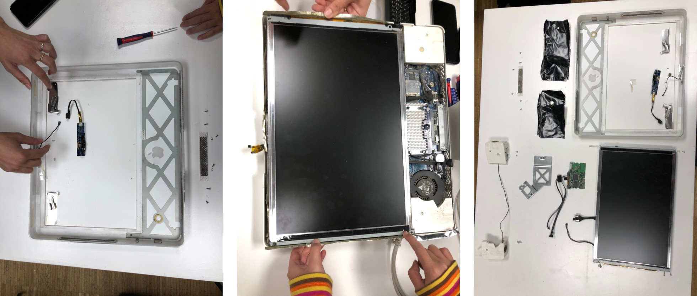

---
hide:
    - toc
---

# Tech Beyond the Myth

Forensic Report: Apple Computer 2006
===============

| Identity of the reporting agency       | MDEF                           |
|----------------------------------------|--------------------------------|
| Case identifier                        | Forensics of the Obsolescence  |
| Identity of the submitter              | Someone at the Fab Lab         |
| Date of receipt                        | 09/11/2021                     |
| Date of report                         | 09/11/2021                     |
| Identity and signature of the examiner | Fiorella, Rei, Emilio, Andrea                     |

## Examination 

serial number: CK6s0083WH4
Brand: Apple (in California)
Model: A1195
Color: White
Assemblied in: China
Specifications: Canadian ICES-003 Class B

## Forensic Questions

It is a personal computer , used for personal work like word processors, it has a camera and microphone built in, for video calls for example, and also has a pair of speakers for sound reproducing.
This model has an optical unit or CD/DVD ROM that can reproduce and burn cd/dvd. This could be used for playing videos or movies.
This computer has a WIFI modem, so it can be connected to the internet.
I have an Intel processor and 8 GB of RAM. It have a monitor and  3 USB ports, 2 input/output for audio and video, and Ethernet port
This device could be used for personal use or work.
This computer in particular still works fine but the capacity of the new equipment makes it obsolete and slow, not adequate to work with the requirements of the equipment, which is  the case of some of the electronic devices. It is not used because it is cheaper and accessible  to buy new equipment at a lower cost. Also hardware like the main processor is expensive and difficult to replace for a new one in order to maintain the device in optimal operation. The RAM memory could be replaced but it is difficult for anyone.
Also Apple stops at certain points to release actualizations to the IOS so that lead to small failures and errors in everyday use.

---

## Steps taken

**Opening the laptop**
First of all we checked if the computer worked. It can be switched on and on the screen appears the log in accounts. 
We could check that the iMac worked but we couldn’t check if any program could be run. So, we cannot affirm if the iMac was discarded because of the requirements or utility. 

We had to check a video to know how to start the disassembly of the computer. We started removing the front part of the case. In order to unscrew we had to find a specific screwdriver because of the special screws. 

After that, we had to disassemble the camera and other devices such as the microphone that was attached to the case. Then we could separate the screen and some parts of the aluminium that covered the electronic system. 

Datasheet for the logicboard (motherboard)
[Apple iMac A1195 Logic board](http://www.barebonekit.net/apple-imac-a1195-820-1960-a-logic-board_i_mballpe8201960a.aspx)

## Conclusions

It was all different kinds of functions and its parts combined in one box. Each functional part was connected to the motherboard with plugs in so that it sends signals to tell what to do through the cords. 

Most of the parts are made by different suppliers. 

Camera, speakers, disc utility, microphone, and hard drive are easy to recognize. 

When we accidentally dropped the CPU to the floor, it bent and was unable to be used again. Some parts are really fragile when it's open.

Camera is isolated from the main function. We noticed that this can be turned on  without the computer's signal so we never know if the computer is reliable until we open it.

There are more than 100 screws used inside.

Most of the metal parts are aluminum. Metals are both made in the process of stamped or molded.

Plastic parts(box) are polycarbonate. 

Everything except the screen is covered with an aluminium sheet in order to avoid heat and radiation.

Some screws are hidden and some parts are glued so that Apple technical support will be able to know if a user opens the computer by themself so that Apple will not support it anymore.

## Opinion

 At opening from the bottom there are two kind of screws, the normal one Phillips screwdriver, but they use a special type of head that is not available to general in public, so that doesn not allow anyone to open the device, you have to take it to Tech support in order to have it open and the computer

The camera card is no attached to the led that show when it is turned on, they are two separates circuits,  so that opens a discussion about how that hardware is used, if it is fully controlled by the user with a physical switch or controlled by a backend command by the builder
The computer has several seals that show when the user opens it,  like small aluminum sheets ori foils  that you have to tear it down. If you do so, that will show to the tech support  when the user opens it and therefore lose the guarantee of the device. With that,  they make sure that the consumer prefer no to open it and to conserve the guarantee.
The body  it Is combined with the PC plastic and steel as a structure, aluminum is used as an isolation back and forward.

There are a lot of boards with different materials, connectors , circuits and capacitors and disipators and most of them are fixed by special screws, almost 85% of them, the rest are regular screws.

We can find also few alloys for heat displacement like aluminum and copper.

There are also tiny plastic part that make the connection to the back part of the computer and the boards or the optical unit to the lateral of the computer.

DETAILS

