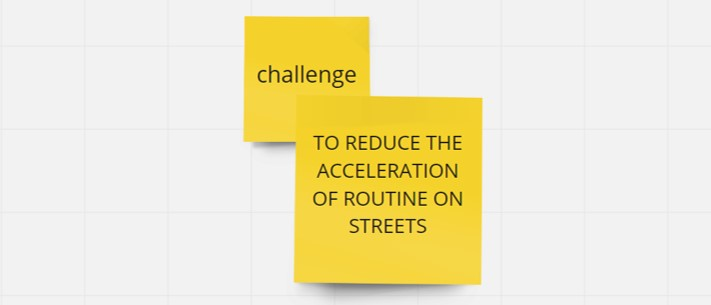

---
hide:
    - toc
---

# Community Engagement

**FINDING A CHALLENGE**

Before finding *the challenge*, we did an introspection for the direction of our path.

After this exercise, I had realized that this is the challenge that I care about. Because, 
I saw myself reflected in several people on street going fast from one point to another, without, actually looking around.  

Besides, after the previous body-meditation-action exercises we had in class, it seems to me, that I was more conscious of my posture and the relationship with it in my routines.

**4D MAPPING OF THE SYSTEM**

It is very interesting how *"things / situations / systems"* can be connected, to understand our position on the map.

*..."be part of the wave, not just a single drop"...* as Marce said.

**The Role of Different Agent / Creative Communities**

**Populate Framework with different projects**

