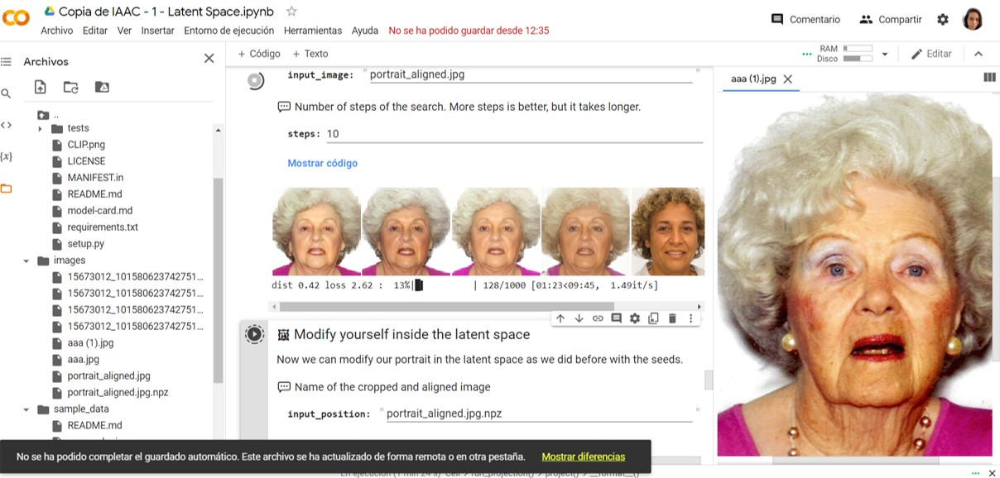
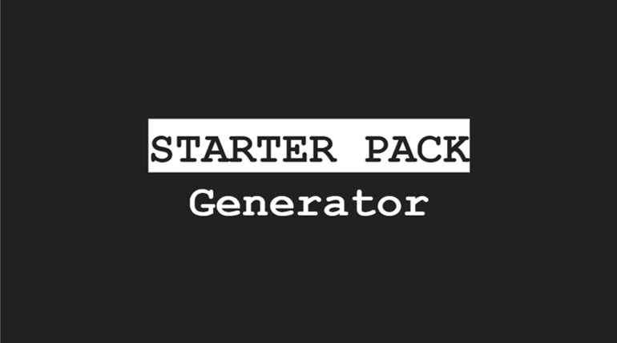
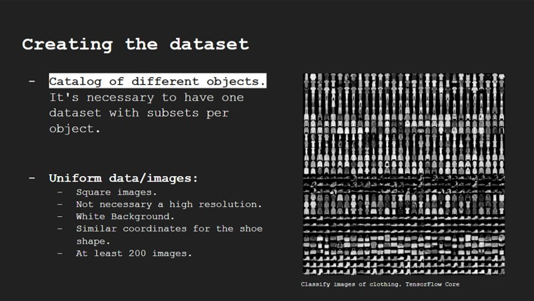
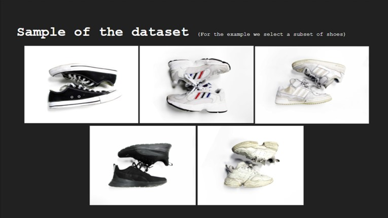
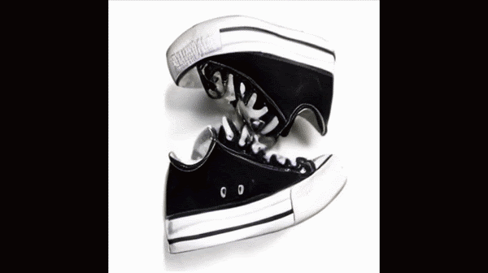
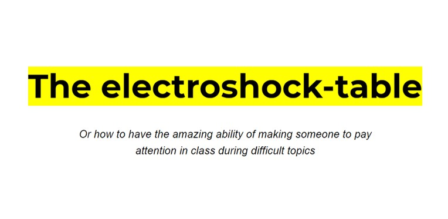
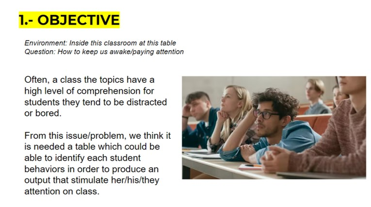
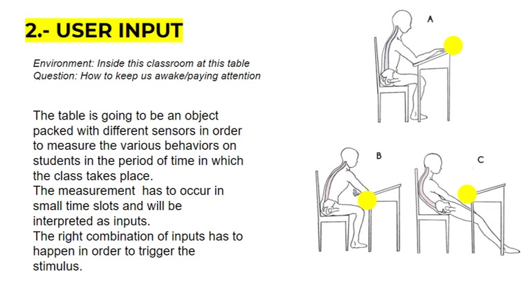
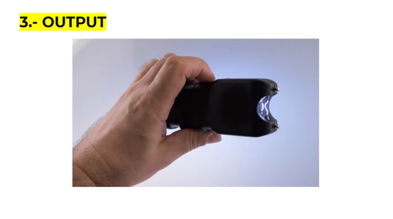
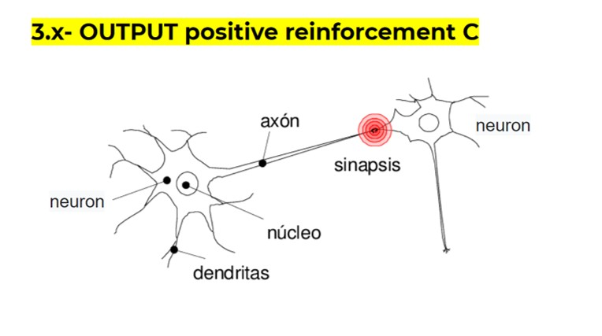

---
hide:
    - toc
---

# Extended Intelligences

Experimentations

**GROUP REFLECTIONS**
>
The image generation from a database allow us to create new visual and personal identities that scape our creative process and allow us a new form of expression ourselves.
This kind of generations can aid in a creative process in order to leave behind human bias, leading to a more spontaneous results.
The creation of new relationships between the merging or the generation of new images can challenge our understanding of our visual world and the way we perceived it through our vision, we can understand from this, that context is fundamental in the construction of our personal reality. What we think it is real, it is not, what we think it couldn't exist, it could.
This kind of process is a source of “Almost infinite” resources for creativity.  
>
**PERSONAL REFLECTIONS**

