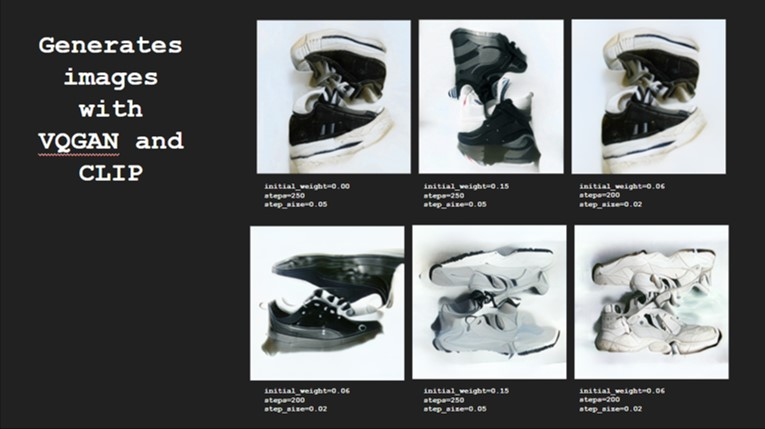
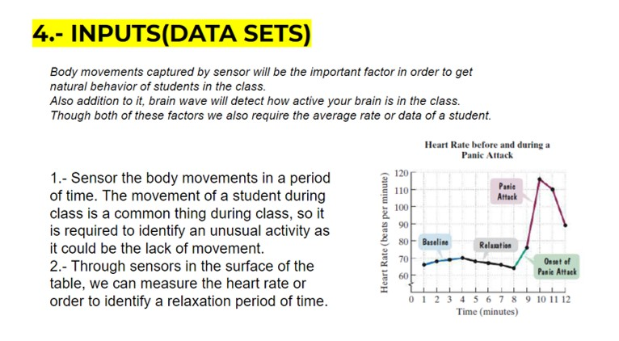

---
hide:
    - toc
---

# Extended Intelligences

**Experimentations**

*********
    Selection of an external portrait

*********
    Very notorious changes in the first portrait images

*********
    Then, the differences went reduced

*********
    AN AUTOMATED DECISION TOOL

**RESULT**

New objects generated by the AI for each category that we create before.
Grid of generated AI sets: Each set of the grid will contain one new object per category setting up the *“artificial identity”*.
Many possibilities of new artifacts and gamma colors for gadgets, garments, accessories, etc. 

**CONSIDERATIONS**

The process of creating database and kept it at day or actualized is complex task, as well the storage of the information and the image formatting for the database.
The results often scape our preconcepcion of aesthetics.

**GROUP REFLECTIONS**

The image generation from a database allow us to create new visual and personal identities that scape our creative process and allow us a new form of expression ourselves.
This kind of generations can aid in a creative process in order to leave behind human bias, leading to a more spontaneous results.
The creation of new relationships between the merging or the generation of new images can challenge our understanding of our visual world and the way we perceived it through our vision, we can understand from this, that context is fundamental in the construction of our personal reality. What we think it is real, it is not, what we think it couldn't exist, it could.
This kind of process is a source of *“Almost infinite”* resources for creativity.  

**PERSONAL REFLECTIONS**
>
In addition, it seems to me that these new espontaneous outputs could 
>

*********
    DESIGNING WITH AI WORKSHOP

**PERSONAL REFLECTIONS**
>

>